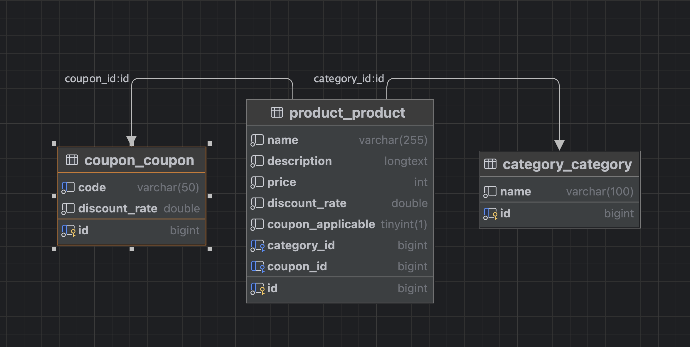

# 프로젝트 개요
Django REST Framework(DRF)를 기반으로 상품, 카테고리 조회 및 상품의 쿠폰 적용을 위한 백엔드 애플리케이션입니다.

# 프로젝트 구조
```
shoppingmall/
├── category/          # 카테고리 관련 앱
│   ├── migrations/    # 데이터베이스 마이그레이션 파일
│   ├── mixin.py       # 카테고리 관련 재사용 가능한 코드
│   ├── models.py      # 카테고리 모델 정의
│   ├── serializers.py # 카테고리 직렬화 클래스
│   ├── tests.py       # 카테고리 관련 테스트 코드
│   ├── urls.py        # 카테고리 URL 라우팅
│   └── views.py       # 카테고리 뷰 로직
├── coupon/            # 쿠폰 관련 앱
│   ├── migrations/    # 데이터베이스 마이그레이션 파일
│   ├── mixin.py       # 쿠폰 관련 재사용 가능한 코드
│   ├── models.py      # 쿠폰 모델 정의
│   ├── response.py    # 쿠폰 응답 관련 로직
│   ├── serializers.py # 쿠폰 직렬화 클래스
│   ├── tests.py       # 쿠폰 관련 테스트 코드
│   ├── urls.py        # 쿠폰 URL 라우팅
│   └── views.py       # 쿠폰 뷰 로직
├── product/           # 상품 관련 앱
│   ├── migrations/    # 데이터베이스 마이그레이션 파일
│   ├── mixin.py       # 상품 관련 재사용 가능한 코드
│   ├── models.py      # 상품 모델 정의
│   ├── serializers.py # 상품 직렬화 클래스
│   ├── tests.py       # 상품 관련 테스트 코드
│   ├── urls.py        # 상품 URL 라우팅
│   └── views.py       # 상품 뷰 로직
├── shoppingmall/      # 프로젝트 설정 디렉토리
│   ├── common/        # 공통 유틸리티 및 설정 파일
│       └── __init__.py 
│       └── asgi.py    # ASGI 설정 파일
│       └── settings.py# Django 설정 파일
│       └── urls.py    # 프로젝트 전역 URL 라우팅
│       └── wsgi.py    # WSGI 설정 파일
├── .flake8            # Flake8 설정 파일 (코드 스타일 검사)
├── .gitignore         # Git에서 무시할 파일 목록 설정
├── docker-compose.yml # Docker Compose 설정 파일 (컨테이너 관리)
└── manage.py          # Django 관리 명령어 실행 스크립트
└── requirements.txt   # 프로젝트에 적용된 패키지 리스트

```

# 주요 기능
### 카테고리 관리
* 카테고리 목록, 상세 조회할 수 있는 기능을 제공합니다.

### 쿠폰 관리
* 쿠폰 목록, 상세 조회할 수 있고 상품에 쿠폰을 적용할 수 있는 기능을 제공합니다.

### 상품 관리
* 상품 목록, 상세 조회할 수 있는 기능을 제공합니다. 상품 상세 정보에는 쿠폰이 적용된 가격을 제공합니다.

# 실행 방법

## 의존성 설치
```
pip install -r requirements.txt
```

## 데이터베이스 마이그레이션
```
python manage.py migrate
```

## 개발 서버 실행
```
python manage.py runserver
```

## 테스트
```
python manage.py test
```

# API 문서
Swagger를 사용한 API 문서를 제공합니다. 개발 서버를 실행한 후 다음 URL에서 확인할 수 있습니다:
* Swagger UI: http://localhost:8000/swagger/
* Redoc: http://localhost:8000/redoc/

# DB

## ERD


## Dummy Data
```sql
INSERT INTO category (id, name) VALUES
(1, '전자제품'),
(2, '가구'),
(3, '의류'),
(4, '도서'),
(5, '주방용품');

INSERT INTO coupon (id, code, discount_rate) VALUES
(1, 'DISCOUNT10', 0.10),
(2, 'DISCOUNT20', 0.20),
(3, 'SPRINGSALE', 0.15);

INSERT INTO product (id, name, description, price, category_id, discount_rate, coupon_applicable, coupon_id) VALUES
(1, '삼성 스마트 TV', '최신형 4K UHD 삼성 스마트 TV', 1500000, 1, 0.05, TRUE, 1),
(2, 'LG 냉장고', '대용량 LG 냉장고, 에너지 효율 등급 A++', 2000000, 1, 0.10, TRUE, 2),
(3, '원목 책상', '튼튼하고 고급스러운 원목 책상', 300000, 2, 0.00, FALSE, NULL),
(4, '소파 세트', '편안한 거실 소파 세트', 800000, 2, 0.15, TRUE, 3),
(5, '겨울 패딩', '따뜻하고 가벼운 겨울 패딩', 200000, 3, 0.20, FALSE, NULL),
(6, '베스트셀러 소설', '감동적인 이야기가 담긴 베스트셀러 소설', 15000, 4, 0.05, FALSE, NULL),
(7, '프라이팬 세트', '내구성이 뛰어난 주방용 프라이팬 세트', 50000, 5, 0.10, TRUE, 1);
```
